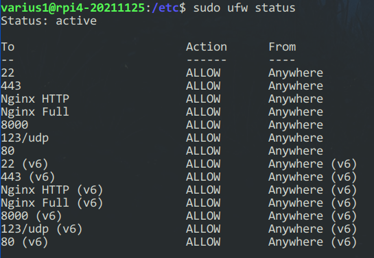
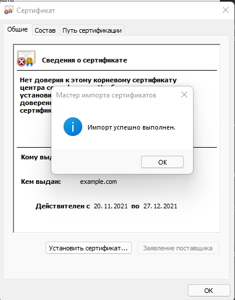
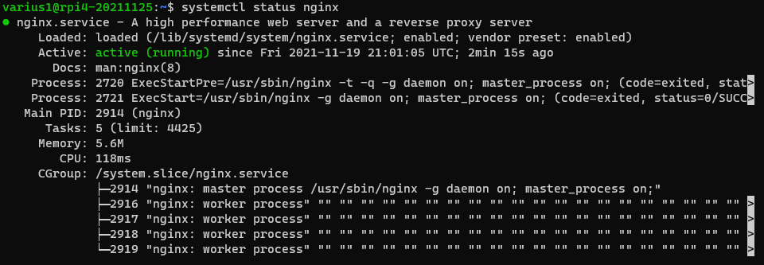
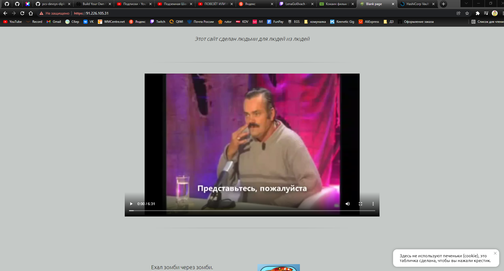
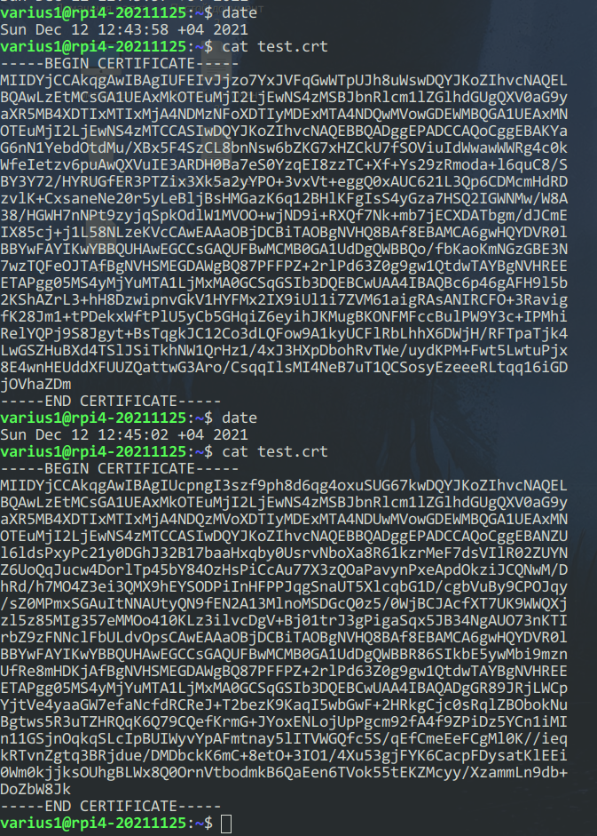

1)  
Linux Debian поднят на raspberry pi 4 на физической машине, т.к. сервер будет использоваться в будущем. В роутере проброшены порты 22, 80 и 443.  
  
2)  
```
varius1@rpi4-20211125:~$ sudo ufw allow 22  
Rules updated  
Rules updated (v6)  
varius1@rpi4-20211125:~$ sudo ufw allow 443  
Rules updated  
Rules updated (v6)
```
  
  
3)  
```
varius1@rpi4-20211125:~$ sudo curl -fsSL https://apt.releases.hashicorp.com/gpg | sudo apt-key add -  
Warning: apt-key is deprecated. Manage keyring files in trusted.gpg.d instead (see apt-key(8)).  
OK  

varius1@rpi4-20211125:~$ sudo apt-add-repository "deb [arch=amd64] https://apt.releases.hashicorp.com $(lsb_release -cs) main"  
``` 
  
  
4)   
Создан корневой сертификат. Сам сертификат приложил в папку DZ.  
  
5)  
  
  
6)  
  
  
7)  
https://91.226.105.31/   
Сайт работает в открытом интернете, можете проверить сами.  
  
  
8)  
  
С этим заданием промучался больше 5 дней. Что я только не пробовал, чтобы сгенерировать "правильный сертификат". Было создано более 50 сертификатов разными способами.  
Через CA, через curl, парсил через js, выводил в консоль напрямую с Vaulta с помощью запроса. Но так и не удалось победить "Подключение не защищено".  
Несколько раз проделал по приложенной инструкции на сайте https://learn.hashicorp.com/. Игрался с групповыми политиками.  
  
Потом начал думать, что проблема в браузере. Испробовал 4 разных браузера. Делал синхронизацию времени на сервере и на компьютере. Отключал антивирус. 
Даже принудительно прописывал в свойствах ярлыка браузера "--ignore-certificate-errors" - и даже это НЕ СРАБОТАЛО!!!!. 
Проверил несколько раз ufw. Поднимал виртуалку (думал, что дело в малине), все тоже самое.  
Устанавливал сертификат в "доверенные корневые центры сертификации", в "доверенные издатели" и в "сторонии издатели". В списках сертификат появлялся. 
Устанавливал напрямую с сайта, скачивал с сервера. 
Так же спрашивал в чате Telegram других учеников, получил только один ответ и тот мне не помог. В общем на это задание ушло очень много времени, но так и не получилось его победить.  
Единственная догадка, это проблема в домене. Vault не понимает адрес по ip и ему нужен домен. Что можно ещё попробовать? Что я не так делаю?   
  
9)  
Скрипт получился такой:  
```
updatecrt.sh  
#!/bin/bash  
export VAULT_ADDR=http://127.0.0.1:8200/  
export VAULT_TOKEN=root  
curl --header "X-Vault-Token: $VAULT_TOKEN" \  
  --request POST \  
  --data '{"common_name": "91.226.105.31", "ttl": "720h"}' \  
     $VAULT_ADDR/v1/pki_int/issue/example-varius2 | jq > superLast.crt  
jq -r .data.certificate  superLast.crt > test.crt | jq -r .data.private_key  superLast.crt > test.key  
sudo systemctl restart nginx  
echo  "success update crt"  
  
В файлике sudoerc прописал такую строчку: %sudo   ALL=NOPASSWD: ALL  - чтобы пользователям/скрипту не нужно было вводить пароль для совершения команд.  
  
Для проверки скрипта, прописал в crontab следующую строчку  
*/1 *    * * *   varius1 /bin/bash /home/varius1/updatecrt.sh - чтоб скрипт отрабатывал каждую минуту  
```
  
   
10)  
Запуск команды каждый месяц 1 числа в 12:00:  
0 12 1 * * varius1 /bin/bash /home/varius1/updatecrt.sh   

