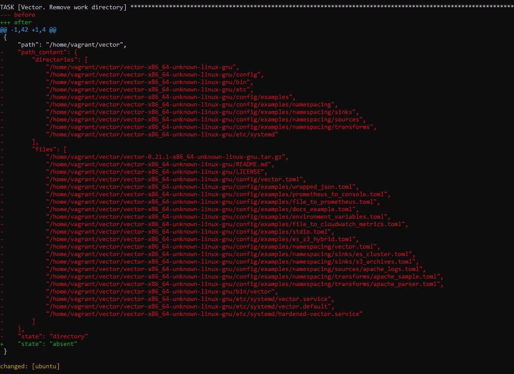

# Домашнее задание к занятию "08.02 Работа с Playbook"


## Подготовка к выполнению

1) Создайте свой собственный (или используйте старый) публичный репозиторий на github с произвольным именем.
2) Cкачайте playbook из репозитория с домашним заданием и перенесите его в свой репозиторий.
3) Подготовьте хосты в соответствии с группами из предподготовленного playbook.

## Основная часть

1) Приготовьте свой собственный inventory файл prod.yml.
<code>[prod.yml](https://github.com/PremiumQQ/devops-netology/blob/main/DZ_2/playbook/inventory/prod.yml)
</code>
2) Допишите playbook: нужно сделать ещё один play, который устанавливает и настраивает vector.
3) При создании tasks рекомендую использовать модули: get_url, template, unarchive, file.
4) Tasks должны: скачать нужной версии дистрибутив, выполнить распаковку в выбранную директорию, установить vector.

<code>[Playbook](https://github.com/PremiumQQ/devops-netology/tree/main/DZ_2/playbook)
</code>
5) Запустите ansible-lint site.yml и исправьте ошибки, если они есть.
Ошибок не оказалось.
6) Попробуйте запустить playbook на этом окружении с флагом --check.

7) Запустите playbook на prod.yml окружении с флагом --diff. Убедитесь, что изменения на системе произведены.

Пример таски, где удаляется директория.
8) Повторно запустите playbook с флагом --diff и убедитесь, что playbook идемпотентен.
9) Подготовьте README.md файл по своему playbook. В нём должно быть описано: что делает playbook, какие у него есть параметры и теги.
```
Теги:
tags: clickhouse (все таски по установке и настройке clickhouse)
tags: vector (все таски по установке и настройке vector)
become: true (даем права рута на выполнение таски)
```
10) Готовый playbook выложите в свой репозиторий, поставьте тег 10-ansible-02-playbook на фиксирующий коммит, в ответ предоставьте ссылку на него.