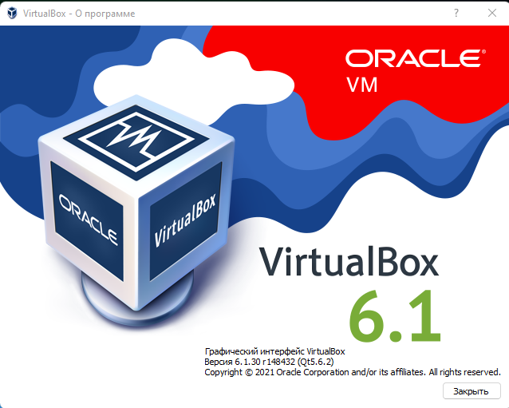

# Домашнее задание к занятию "5.2. Применение принципов IaaC в работе с виртуальными машинами"


## Обязательная задача 1
Опишите своими словами основные преимущества применения на практике IaaC паттернов.
Какой из принципов IaaC является основополагающим?

```
Развернуть инфраструктуру для разработчки и тестирования можно за короткий промежуток времени. У всех будут одинаковые настройки и установленные приложения.
Не получится так, что у одного работает, а у другого нет. 
Главный принцип это то, что каждый раз разворачивая инфрастуктуру с помощью кода, мы получим идетничный результат.
```

## Обязательная задача 2
Чем Ansible выгодно отличается от других систем управление конфигурациями?
Какой, на ваш взгляд, метод работы систем конфигурации более надёжный push или pul

```
В Ansible низкий порог вхождения, т.е. не нужно обладать большими навыками в разрабоке чтобы им пользоваться.
Самый популярный сервис среди крупных компаний. 
pull - потому сервер сам заправшивает конфигурацию после его разворачивания. 
В методе push может возникнуть проблема, когда сервер какое-то время будет сидеть и ждать когда ему пришлют конфигурацию.
```

## Обязательная задача 3
Установить на личный компьютер:

VirtualBox
Vagrant
Ansible
Приложить вывод команд установленных версий каждой из программ, оформленный в markdown.

VirtualBox



Vagrant
```
PS E:\vagrant> vagrant --version
Vagrant 2.2.19
```
Ansible
```
vagrant@vagrant:~$ ansible --version
ansible [core 2.12.1]
  config file = /etc/ansible/ansible.cfg
  configured module search path = ['/home/vagrant/.ansible/plugins/modules', '/usr/share/ansible/plugins/modules']
  ansible python module location = /usr/lib/python3/dist-packages/ansible
  ansible collection location = /home/vagrant/.ansible/collections:/usr/share/ansible/collections
  executable location = /usr/bin/ansible
  python version = 3.10.0b1 (default, May 11 2021, 08:45:09) [GCC 10.3.0]
  jinja version = 2.11.2
  libyaml = False
```

## Дополнительное задание (со звездочкой*) - необязательно к выполнению

Воспроизвести практическую часть лекции самостоятельно.

Создать виртуальную машину.
Зайти внутрь ВМ, убедиться, что Docker установлен с помощью команды

```
vagrant@vagrant:~$ sudo docker ps
CONTAINER ID   IMAGE     COMMAND   CREATED   STATUS    PORTS     NAMES
vagrant@vagrant:~$ sudo docker -v
Docker version 20.10.12, build e91ed57
```