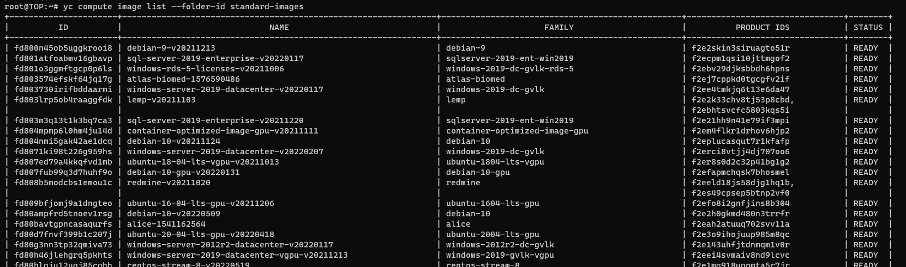

# Домашнее задание к занятию "7.2. Облачные провайдеры и синтаксис Terraform."


## Задача 1 (Вариант с Yandex.Cloud). Регистрация в ЯО и знакомство с основами.

1) Подробная инструкция на русском языке содержится здесь.
2) Обратите внимание на период бесплатного использования после регистрации аккаунта.
3) Используйте раздел "Подготовьте облако к работе" для регистрации аккаунта. Далее раздел "Настройте провайдер" для подготовки базового терраформ конфига.
4) Воспользуйтесь инструкцией на сайте терраформа, что бы не указывать авторизационный токен в коде, а терраформ провайдер брал его из переменных окружений.

## Задача 2. Создание aws ec2 или yandex_compute_instance через терраформ.

1) В каталоге terraform вашего основного репозитория, который был создан в начале курсе, создайте файл main.tf и versions.tf.
2) Зарегистрируйте провайдер для yandex.cloud. Подробную инструкцию можно найти здесь.
3) Внимание! В гит репозиторий нельзя пушить ваши личные ключи доступа к аккаунту. Поэтому в предыдущем задании мы указывали их в виде переменных окружения.
4) В файле main.tf воспользуйтесь блоком data "aws_ami для поиска ami образа последнего Ubuntu.

5) В файле main.tf создайте ресурс yandex_compute_image.
6) Если вы выполнили первый пункт, то добейтесь того, что бы команда terraform plan выполнялась без ошибок.
```
premiumq@TOP:/opt/terraform$ terraform validate
Success! The configuration is valid.
premiumq@TOP:/opt/terraform$ sudo terraform plan
Plan: 3 to add, 0 to change, 0 to destroy.

Changes to Outputs:
  + external_ip_address_vm_1 = (known after apply)
  + internal_ip_address_vm_1 = (known after apply)

Note: You didn't use the -out option to save this plan, so Terraform can't guarantee to take exactly these actions if you run "terraform apply" now.
```

В качестве результата задания предоставьте:

Ответ на вопрос: при помощи какого инструмента (из разобранных на прошлом занятии) можно создать свой образ ami?
```
Packer
```
Ссылку на репозиторий с исходной конфигурацией терраформа.

<code>[main.tf](main.tf)
</code>
