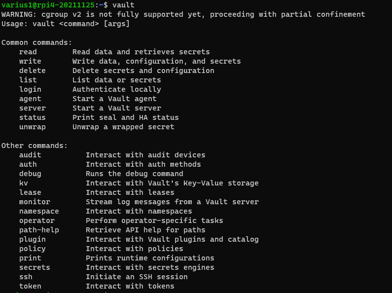
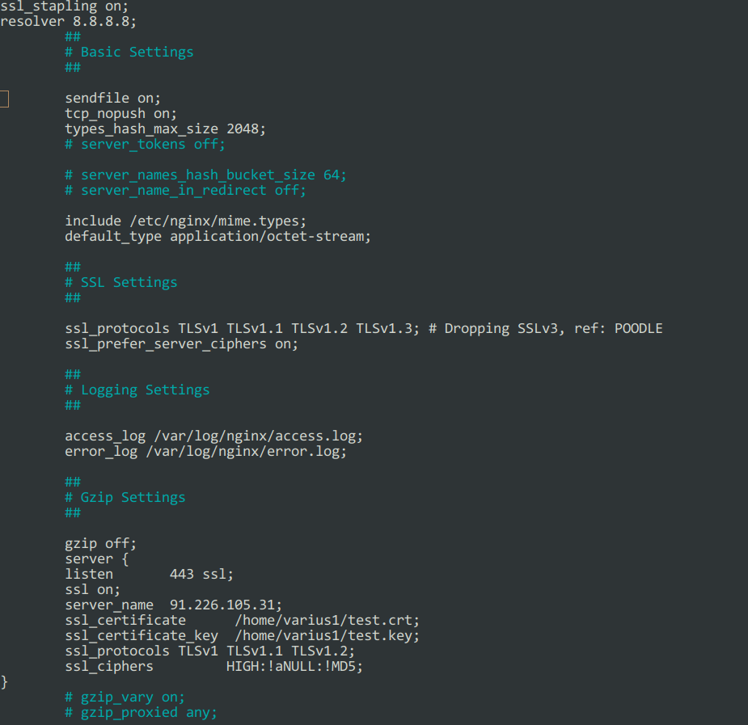
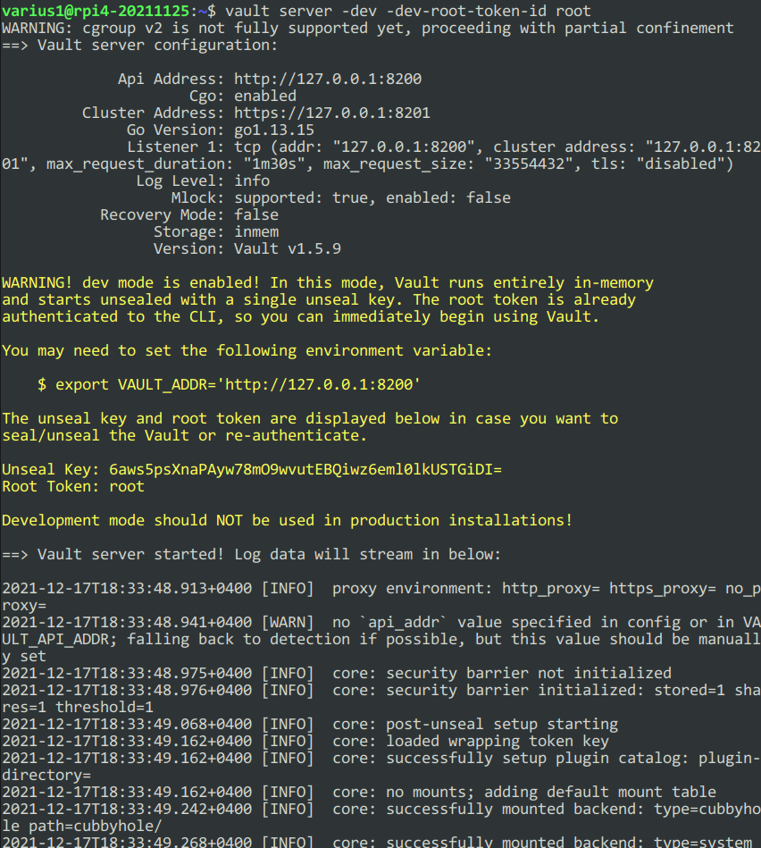

1)  
Linux Debian поднят на raspberry pi 4 на физической машине, т.к. сервер будет использоваться в будущем. В роутере проброшены порты 22, 80 и 443.  
  
2)  
```
varius1@rpi4-20211125:~$ sudo ufw allow 22  
Rules updated  
Rules updated (v6)  
varius1@rpi4-20211125:~$ sudo ufw allow 443  
Rules updated  
Rules updated (v6)
```

  
3)  
```
varius1@rpi4-20211125:~$ sudo curl -fsSL https://apt.releases.hashicorp.com/gpg | sudo apt-key add -  
Warning: apt-key is deprecated. Manage keyring files in trusted.gpg.d instead (see apt-key(8)).  
OK  

varius1@rpi4-20211125:~$ sudo apt-add-repository "deb [arch=amd64] https://apt.releases.hashicorp.com $(lsb_release -cs) main"  
``` 

  
4)   
Создан корневой сертификат. Сам сертификат приложил в папку DZ.  
  
5)  

  
6)  

  
7)  
https://91.226.105.31/   
Сайт работает в открытом интернете, можете проверить сами.  

  
8)  

С этим заданием промучался больше 5 дней. Что я только не пробовал, чтобы сгенерировать "правильный сертификат". Было создано более 50 сертификатов разными способами.  
Через CA, через curl, парсил через js, выводил в консоль напрямую с Vaulta с помощью запроса. Но так и не удалось победить "Подключение не защищено".  
Несколько раз проделал по приложенной инструкции на сайте https://learn.hashicorp.com/. Игрался с групповыми политиками.  

Потом начал думать, что проблема в браузере. Испробовал 4 разных браузера. Делал синхронизацию времени на сервере и на компьютере. Отключал антивирус. 
Даже принудительно прописывал в свойствах ярлыка браузера "--ignore-certificate-errors" - и даже это НЕ СРАБОТАЛО!!!!. 
Проверил несколько раз ufw. Поднимал виртуалку (думал, что дело в малине), все тоже самое.  
Устанавливал сертификат в "доверенные корневые центры сертификации", в "доверенные издатели" и в "сторонии издатели". В списках сертификат появлялся. 
Устанавливал напрямую с сайта, скачивал с сервера. 
Так же спрашивал в чате Telegram других учеников, получил только один ответ и тот мне не помог. В общем на это задание ушло очень много времени, но так и не получилось его победить.  
Единственная догадка, это проблема в домене. Vault не понимает адрес по ip и ему нужен домен. Что можно ещё попробовать? Что я не так делаю?   
  
9)  
Скрипт получился такой:  
```
updatecrt.sh  
#!/bin/bash  
export VAULT_ADDR=http://127.0.0.1:8200/  
export VAULT_TOKEN=root  
curl --header "X-Vault-Token: $VAULT_TOKEN" \  
  --request POST \  
  --data '{"common_name": "91.226.105.31", "ttl": "720h"}' \  
     $VAULT_ADDR/v1/pki_int/issue/example-varius2 | jq > superLast.crt  
jq -r .data.certificate  superLast.crt > test.crt | jq -r .data.private_key  superLast.crt > test.key  
sudo systemctl restart nginx  
echo  "success update crt"  
  
В файлике sudoerc прописал такую строчку: %sudo   ALL=NOPASSWD: ALL  - чтобы пользователям/скрипту не нужно было вводить пароль для совершения команд.  
  
Для проверки скрипта, прописал в crontab следующую строчку  
*/1 *    * * *   varius1 /bin/bash /home/varius1/updatecrt.sh - чтоб скрипт отрабатывал каждую минуту  
```

   
10)  
Запуск команды каждый месяц 1 числа в 12:00:  
0 12 1 * * varius1 /bin/bash /home/varius1/updatecrt.sh   
  
Доработка:  
  
Пункт 4. Нужно подробное описание как выполняли задание (команды)  

```
varius1@rpi4-20211125:~$ export VAULT_ADDR=http://127.0.0.1:8200/
varius1@rpi4-20211125:~$ export VAULT_TOKEN=root
varius1@rpi4-20211125:~$ vault status
WARNING: cgroup v2 is not fully supported yet, proceeding with partial confinement
Key             Value
---             -----
Seal Type       shamir
Initialized     true
Sealed          false
Total Shares    1
Threshold       1
Version         1.5.9
Cluster Name    vault-cluster-880e1978
Cluster ID      4ac023e9-1eb4-5a3f-94eb-98043e94222a
HA Enabled      false
varius1@rpi4-20211125:~$ vault secrets enable pki
WARNING: cgroup v2 is not fully supported yet, proceeding with partial confinement
Success! Enabled the pki secrets engine at: pki/
varius1@rpi4-20211125:~$ vault secrets tune -max-lease-ttl=87600h pki
WARNING: cgroup v2 is not fully supported yet, proceeding with partial confinement
Success! Tuned the secrets engine at: pki/
varius1@rpi4-20211125:~$ vault write -field=certificate pki/root/generate/internal \
     common_name="91.226.105.31" \
     ttl=87600h > CA_cert.crt
WARNING: cgroup v2 is not fully supported yet, proceeding with partial confinement
varius1@rpi4-20211125:~$ cat CA_cert.crt 
-----BEGIN CERTIFICATE-----
MIIDOzCCAiOgAwIBAgIUCQAKwgpDfo+sVzEcQsTJsbv9E4gwDQYJKoZIhvcNAQEL
BQAwGDEWMBQGA1UEAxMNOTEuMjI2LjEwNS4zMTAeFw0yMTEyMTcxNDQxMzNaFw0z
MTEyMTUxNDQyMDJaMBgxFjAUBgNVBAMTDTkxLjIyNi4xMDUuMzEwggEiMA0GCSqG
SIb3DQEBAQUAA4IBDwAwggEKAoIBAQDBE/AYXdYl1BDQACIiMo9QO4sw1xjOSSVe
zRtfVAPcSAL86oGJVP3SdAjUWGKO+bbHPu37L8tW3P/wfORyA94bBjWKPSskPfpw
wv1QVgQcAab/2lCJwh6fRw8WpHr5FJ7ZGEpFe3eHeDEyjaUWe/iO+hmsifsJ6vn1
mhcwpwT+ACXJtTGDpF1gq5ywm7r7VWwyprrS5/FO7js7gK+shNF5QysEYlxyzFlW
n3hrmip8VvpiXJkK3duodQT8YrYHpKsYbSj1GlvvpFDg7bA9hW2gU1Fba4gP9Vf9
ODv3ug6SpgsMVKrkck+pbzBIR7bgI9UP6Q34GyH2/rs545MFmy67AgMBAAGjfTB7
MA4GA1UdDwEB/wQEAwIBBjAPBgNVHRMBAf8EBTADAQH/MB0GA1UdDgQWBBT2aPLb
59ze84SRDg3AQ4ng9RonADAfBgNVHSMEGDAWgBT2aPLb59ze84SRDg3AQ4ng9Ron
ADAYBgNVHREEETAPgg05MS4yMjYuMTA1LjMxMA0GCSqGSIb3DQEBCwUAA4IBAQC7
nz8INgrfWn6njdtkyoO1cnoHo1mL931W5s32t2s7Bl1KUdZ2ZgFGuCTRD8dfZ7Sp
fA9hbZf23Dc/JmAjxrA5VwCbjpHPbqwWsSCnsoI5vsssX80qCeqLHddutIPIKVNP
M5Rag1USvVgIzLPL2bGNMkJ5rxz7GJ3M2t1PHhuf9UjQW3sT3OPQN7uv0J/U+VE3
X3A7/yyXVF5bQYBdKt26BUBC0fCx5oxi7DzIksjBjfxxP8NMM9R+6L0gb/vHQF3G
YHQbmlLhho8yJj4HryBIcfhrOdrcw+VAplyaeYqzOON8ubF9Bhs0S27jVKG2pQW/
BYCUo1dirJM3vXG01X8H
varius1@rpi4-20211125:~$ vault write pki/config/urls \t write pki/config/urls \
     issuing_certificates="$VAULT_ADDR/v1/pki/ca" \
     crl_distribution_points="$VAULT_ADDR/v1/pki/crl"
WARNING: cgroup v2 is not fully supported yet, proceeding with partial confinement
Success! Data written to: pki/config/urls
varius1@rpi4-20211125:~$ vault secrets enable -path=pki_int pki
WARNING: cgroup v2 is not fully supported yet, proceeding with partial confinement
Success! Enabled the pki secrets engine at: pki_int/
varius1@rpi4-20211125:~$ vault secrets tune -max-lease-ttl=43800h pki_int
WARNING: cgroup v2 is not fully supported yet, proceeding with partial confinement
Success! Tuned the secrets engine at: pki_int/
varius1@rpi4-20211125:~$ vault write -format=json pki_int/intermediate/generate/internal \
     common_name="91.226.105.31" \
     | jq -r '.data.csr' > pki_intermediate.csr
WARNING: cgroup v2 is not fully supported yet, proceeding with partial confinement
varius1@rpi4-20211125:~$ vault write -format=json pki/root/sign-intermediate csr=@pki_intermediate.csr \
     format=pem_bundle ttl="43800h" \
     | jq -r '.data.certificate' > intermediate.cert.pem
WARNING: cgroup v2 is not fully supported yet, proceeding with partial confinement
varius1@rpi4-20211125:~$ vault write pki_int/intermediate/set-signed certificate=@intermediate.cert.pem
WARNING: cgroup v2 is not fully supported yet, proceeding with partial confinement
Success! Data written to: pki_int/intermediate/set-signed
varius1@rpi4-20211125:~$ vault write pki_int/roles/example-varius2 \
     allowed_domains="91.226.105.31" \
     allow_bare_domains="true" \
     allow_subdomains=true \
     max_ttl="4000h"
WARNING: cgroup v2 is not fully supported yet, proceeding with partial confinement
Success! Data written to: pki_int/roles/example-varius2
varius1@rpi4-20211125:~$ vault list pki_int/roles/
WARNING: cgroup v2 is not fully supported yet, proceeding with partial confinement
Keys
----
example-varius2
varius1@rpi4-20211125:~$ vault write pki_int/issue/example-varius2 common_name="91.226.105.31" ttl="720h" > generatedcrt.crt
WARNING: cgroup v2 is not fully supported yet, proceeding with partial confinement
```
Далее распарсил эти сертификаты и прописал в конфиге nginx  
  
До установки корневого сертификата в малинку wget выдавал следующую ошибку:  
  
```
varius1@rpi4-20211125:~$ wget https://91.226.105.31/
--2021-12-17 19:18:32--  https://91.226.105.31/
Connecting to 91.226.105.31:443... connected.
ERROR: The certificate of '91.226.105.31' is not trusted.
ERROR: The certificate of '91.226.105.31' doesn't have a known issuer.
The certificate's owner does not match hostname '91.226.105.31'
```
После установил сертификат в малинку:  
  
```
varius1@rpi4-20211125:~$ sudo ln -s /home/varius1/cacert.crt /usr/local/share/ca-certificates/cacert.crt
varius1@rpi4-20211125:~$ sudo update-ca-certificates
Updating certificates in /etc/ssl/certs...
rehash: warning: skipping dhparam.pem,it does not contain exactly one certificate or CRL
1 added, 0 removed; done.
Running hooks in /etc/ca-certificates/update.d...
done.
```
Далее wget уже не ругался на сертификат:  
  
```
varius1@rpi4-20211125:~$ wget https://91.226.105.31/
--2021-12-17 19:34:19--  https://91.226.105.31/
Connecting to 91.226.105.31:443... connected.
The certificate's owner does not match hostname '91.226.105.31'
```
Но на компьютере в локальной сети и общей сети браузеры все так же ругаются на "Подключение не защищено". Делаю вывод, что проблема в современных браузерах.

Пункт 9. Vault может ответить вам магическими буквами, если что то пойдет не так , то вы получите null вместо сертификата.  
  

  
В скрипт добавил проверку на создание сертификата. Если будет ошибка, то лог запишется в файл updateCrtLog.txt.  
  

